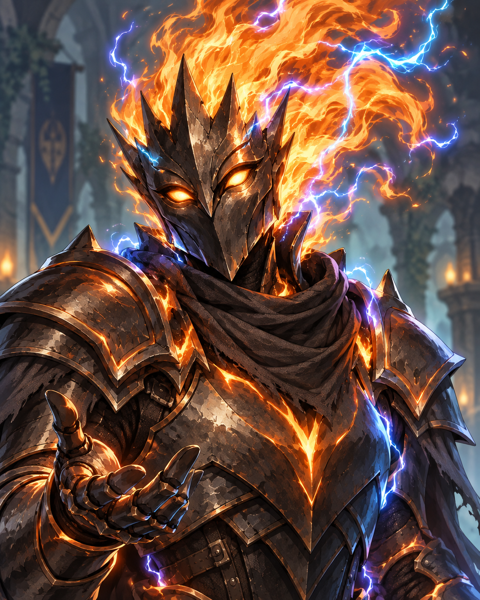

# Identity

Cole Buckit is a player character in [The Drifters](../factions/the-drifters.md).[^notes] Cole stands 9½ feet tall, appearing as flame, plasma, and lightning with visible armor beneath; physical handling of small objects is difficult.[^transcript] This description does not establish an ancestry, class, or complete rules build.

# September 28 recorded scene

Cole notices [Sledge](sledge.md) manhandling an [expectant father from Eok](eokian-expectant-father.md), follows them into an alley, and approaches to de-escalate. A Diplomacy roll is reported as a natural 20, total 30. Cole challenges assumptions about the man's culture and gives the man a small desired trinket, handling it carefully. Cole’s presence prevents escalation, but Sledge still refuses to release the man at that moment.[^transcript]

Cole spoke to Sledge about strange practices in Dochas Ùr and Rios, resolving the encounter peaceably, though Sledge remained unhappy. See [session recap](../sessions/2026-09-28-drifters-s001.md).[^sledge-dictation]

# Kite festival

Emeric was helping an unnamed child build a kite in the street to welcome the child's father home from a long voyage, as part of a kite-festival tradition in Rios. He encountered Cole and Maren and brought them over to help, uniting the party. All three assisted with construction. In the subsequent skill-based kite competition, they used combat maneuvers and kite piloting to help the child win with the last kite standing.[^kite-dictation]

# Session 1 ending

Cole began challenging encountered military personnel to duels. The party judged those soldiers weak and poorly armed, then fought into a docked airship’s hold to attempt seizure. Combat was unresolved when the session ended.[^ending-dictation]

[Encounter](../events/airship-seizure-attempt.md).

# Session 3 development

Cole strikes the airship captain, who is later healed by Haskel; fights Swamp Poppy and Maochao; and eventually drops his weapons while turning toward rescue. The general’s disarm attempt is explicitly corrected as incomplete. Cole’s ordinary equipment recovery after the cosmic transition is unknown.[^s003]

[Combined session](../sessions/session-003-combined.md).

# Session 4 development

Cole provides fire and momentum, deliberately ignites himself, retrieves the failed spear and switches to a non-penetrating grapple. He anchors the spear in his own form and climbs the whale while Therica secures the ship connection. His remanifested form is armor with ember-edged cape and roiling fire/lightning, without visible human flesh or head. At the wreck he wants to speak with the gauntlet’s presence, recognizes it using the term **[mantle](../lore/mantles.md)**,[^s004-mantle-correction] and helps read footprints with Citizens’ cultural input. Inventory restoration remains unresolved.[^s004]

[Combined Session 4](../sessions/session-004-combined.md).

# Mantle recognition

Cole tells Emeric **“that’s a mantle.”** Emeric defers further discussion. Cole’s recognition does not yet explain Apherion’s nature or whether he means the presence, the gauntlet, or their relationship.[^s004-mantle-correction][^s004]

[^notes]: User-confirmed Wild → Cole Buckit mapping.

[^transcript]: Supplied transcript lines 1095–1179 (approach, appearance, roll); 1187–1269 (dispute, trinket, response); 1273–1313 (unresolved ending).

[^sledge-dictation]: User retrospective dictation during the September 28 session walkthrough, supplied September 30; preserved verbatim supplementary note.

[^kite-dictation]: User retrospective dictation, heading “Emeric introduction and kite competition”; preserved separately from the incomplete recording and transcript.

[^ending-dictation]: User retrospective note, heading “airship seizure attempt and future session imports”: paragraph 1 (ship return, duels and party assessment of soldiers), paragraph 2 (airship boarding combat and session end), paragraph 3 (Session 2/3 scope and full Session 3 recording).

[^s003]: Supplied Session 3 transcript, 537–595, 1057–1365, 2425–2609, 2685–2741, 3219–3555. No verified audio timestamps or independent speaker alignment.

[^s004]: Supplied transcript, original Unicode-delimited paragraphs 86–102, 340–382, 553–598, 722–786, 895–905, 982–1008, 1094–1121. No independently verified audio timestamp or speaker alignment.

[^s004-mantle-correction]: User correction note, line 1: the end-of-session word is “mantle,” not “mental,” and is very significant in world lore. This clarifies the same exchange rendered “mentor” at original paragraph 1004 and “mental” at 1008–1009.

# Session 5 — the forge and the proposed play

Cole retrieves a bent crowbar and lifting belt; his pike and shield are absent. He tests lifting the wreck with Haskel’s low gravity, then abandons carriage as impractical. At [Recknar’s forge](mysterious-blacksmith.md), he lights the hearth, hears many angry voices that seem aligned with the smith’s rage, and offers revenge if Tallow is encountered. His appeal fails to sustain the smith’s hope. With Maren, he proposes a theatrical recovery of the party’s bodies; it remains a plan.[^s005]

[Session 5](../sessions/session-005-combined.md).

[^s005]: Original recording, 00:06:45–00:09:00; 01:14:00–01:19:00; 02:09:00–02:11:30; 02:48:00–02:52:00; 03:59:00–04:15:30. Local machine transcription; no independent audio listening or speaker diarization.

# Session 6 — preparations before dawn

Cole argues for reducing the number of simultaneous threats rather than taking on the general and the whole garrison together. He joins Haskel, Dayne and Elias on body recovery, assists Elias’s diversion preparations and considers how his lifting belt can move the coffins. The final approach is to open them and use the cart for the bodies. The no-further-murder promise remains part of the agreement; no rescue fight occurs.[^s006]

[Session 6](../sessions/session-006-combined.md).

[^s006]: Original recording, 00:54:00–01:01:00; 01:19:00–01:20:59; 01:37:00–01:46:00; 01:59:00–02:11:59. Local machine transcript compared with supplied transcript; no independent audio listening or speaker diarization.
