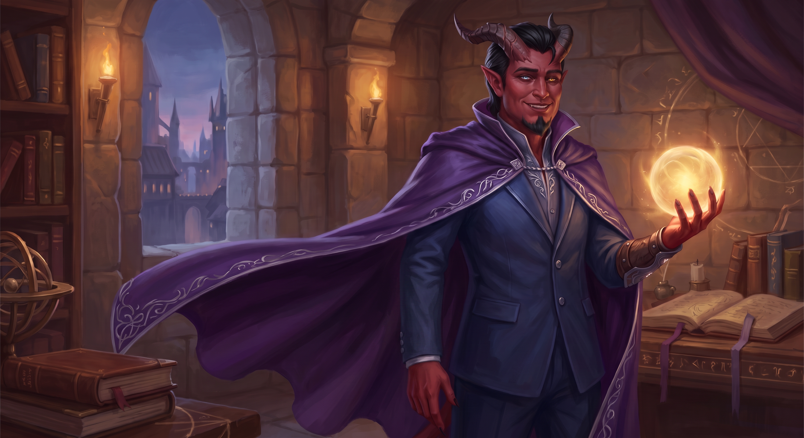

# Identity

Emeric Bellamy is a player character in [The Drifters](../factions/the-drifters.md).[^notes]

# Current coverage

See roster and [session](../sessions/2026-09-28-drifters-s001.md).

# Introduction and party assembly

Emeric was helping an unnamed child build a kite in the street to welcome the child's father home from a long voyage, as part of a kite-festival tradition in Rios. He encountered Cole and Maren and brought them over to help, uniting the party. All three assisted with construction. In the subsequent skill-based kite competition, they used combat maneuvers and kite piloting to help the child win with the last kite standing.[^kite-dictation]

See [The Drifters](../factions/the-drifters.md) and [festival](../events/remembrance-festival.md).

# Persuading Therica to join

The party accepted Therica’s mission. Emeric persuaded her to accompany them with a very high roll, and she agreed immediately; neither the exact roll nor the skill used is known.[^departure-dictation]

# Former Howl boundary

Emeric perceived enormous creatures standing or walking in the sea, and one appeared to look at him. This records his perception; it does not establish that everyone saw the creatures, that they were physically present, or that they were Titans.[^sea-dictation]

See [crossing record](../events/former-howl-crossing.md).

# Session 3 development

Emeric casts Calm during the airship confrontation; the general resists while other participants are affected. He heals Cole, later weakens Maochao and lends Cole a sword. By the end of Session 3, his inventory and a return to a living body remain unresolved.[^s003]

[Combined session](../sessions/session-003-combined.md).

# Apherion

[Apherion](apherion.md), the voice encountered during the rescue, appears connected to Emeric. The nature of that connection is unresolved.[^s003-name-correction]

# Session 4 development

Emeric supports and heals the living ship, transfers vitality to Cole, attempts Calm on Oma, and later heals the group/ship/whale. His return form is translucent and flesh-like, with internal white/yellow light, red core and rusted horns, one damaged. The gauntlet privately tells him the forms can last about 30 hours; he explicitly does not disclose the deadline. He publicly accepts responsibility for seeking its help but cannot promise never to use it again; the voice disputes his framing of having used it. This makes the prior apparent Apherion connection concrete as the continuing voice associated with his gauntlet, without establishing its true nature.[^s004]

[Combined Session 4](../sessions/session-004-combined.md).

# Cole’s mantle recognition

At the wreck, Cole recognizes something associated with Emeric’s gauntlet or its presence as a **[mantle](../lore/mantles.md)**. Emeric postpones further discussion; the term’s meaning and the nature of this connection remain unknown.[^s004-mantle-correction][^s004]

[^notes]: User session-context note, Ash → Emeric Bellamy mapping.

[^kite-dictation]: User retrospective dictation, heading “Emeric introduction and kite competition”; preserved separately from the incomplete recording and transcript.

[^departure-dictation]: User retrospective note, heading “acceptance, companions and departure briefing”: paragraphs 1–3 (acceptance, persuasion and political concern), paragraph 4 (research, captain and Saga), paragraph 5 (departure and incomplete precept briefing).

[^sea-dictation]: User retrospective note, heading “sea journey, Howl crossing and Eok testimony”: paragraphs 1–2 (captain, affliction and Titans), 3–4 (Howl crossing and perceptions), 5–8 (Nathaniel’s fragmentary Eok account and within-note victus correction).

[^s003]: Supplied Session 3 transcript, 1375–1545, 2425–2609, 4415–4573. No verified audio timestamps or independent speaker alignment.

[^s003-name-correction]: User correction note, line 1 (Whipperwill); line 2 (Apherion identifies the voice/presence and appears connected to Emeric, dictated “Emerich”). The connection’s nature is unconfirmed.

[^s004]: Supplied transcript, original Unicode-delimited paragraphs 108–122, 422–440, 795–807, 881–883, 910–921, 956–1008. No independently verified audio timestamp or speaker alignment.

[^s004-mantle-correction]: User correction note, line 1: the end-of-session word is “mantle,” not “mental,” and is very significant in world lore. This clarifies the same exchange rendered “mentor” at original paragraph 1004 and “mental” at 1008–1009.

# Session 5 — the deadline disclosed

Emeric publicly reveals the roughly thirty-hour support limit, the unspecified possibility of extension and his refusal to accept further group bargains alone. He says the presence could not find their bodies and used available material instead. This supersedes his nondisclosure at the end of Session 4. His healing supplies, gifted sword and orb are missing from the wreck. At the forge he recognizes the smith’s sleeplessness, malnourishment and distress; the party leaves without establishing the man’s later fate.[^s005]

[Session 5](../sessions/session-005-combined.md).

[^s005]: Original recording, 00:09:00–00:10:26; 00:20:25–00:25:00; 01:45:00–01:48:30; 02:44:30–02:46:30. Local machine transcription; no independent audio listening or speaker diarization.

# Session 6 — preparations before dawn

Emeric’s temporary thumb begins coming loose. With the party’s consent, he asks Apherion what is required for restoration and promises to relay its words without editing. He rejects testing death on a companion and reassures Koris when the presence proposes her as an experiment. He assembles a vampire-wizard disguise for Maren and joins the performance team. The presence’s uncertainty leaves collapse consequences unresolved.[^s006]

[Session 6](../sessions/session-006-combined.md).

[^s006]: Original recording, 00:20:57–00:33:00; 00:58:30–01:16:59. Local machine transcript compared with supplied transcript; no independent audio listening or speaker diarization.
