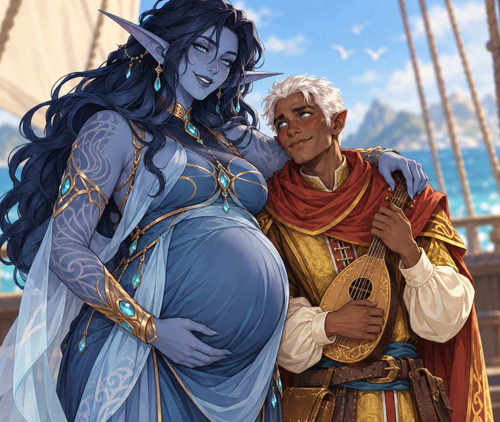

# Identity

Nataniel, also recorded as Nathaniel, is an elf from Eok. He is married to Sledge’s daughter, Saga, and they are expecting a child. His name’s exact spelling remains unsettled.[^transcript]

# Attributed statements

After Sledge alleges he will kill the child, the man says it is only for a moment, they bring the child back, it provides future protection, and his wife also wants it. The details are garbled and the ritual is not identified. These are his attributed claims; no actual death, resurrection, consent confirmation, or ritual efficacy is established.[^transcript]

Cole intervenes and gives him a desired trinket. By discussing strange practices in Dochas Ùr and Rios with Sledge, Cole brings the encounter to a peaceful end, though Sledge remains unhappy.[^transcript][^sledge-dictation]

# Related

[Sledge](sledge.md), [Cole Buckit](cole-buckit.md), [session recap](../sessions/2026-09-28-drifters-s001.md).

# The intended ceremony

Nataniel and Saga apparently planned a traditional birth ceremony in which their child would effectively be killed. Saga appeared to agree, while her father Sledge was outraged. No performed ceremony or outcome for the child is known.[^departure-dictation][^sledge-dictation]

# Journey companion

[Saga](saga.md), Sledge’s daughter, is his wife. Both joined the party’s voyage, with Nataniel offering information about his homeland, Eok.[^departure-dictation]

# Fragmentary voyage briefing

During the journey he offered a disjointed overview of Eok. His account is unreliable. His claims about population, victus objects, arcane-plot resurrection, sacred fish and sky, magic restrictions, military service, and the Court’s guild are preserved as attributed testimony, with unknown scope and no direct verification.[^sea-dictation]

# Session 3 development

The later Session 3 table discussion places a victus at birth. This is a GM/table clarification distinct from this NPC’s earlier incomplete briefing; it does not by itself validate his other claims or establish the fate of his expected child.[^s003]

[Combined session](../sessions/session-003-combined.md).

[^transcript]: Supplied transcript lines 1039–1069 (name and description), 1187–1209 (family), 1211–1269 (trinket and claims), 1273–1313 (ending).

[^sledge-dictation]: User retrospective dictation during the September 28 session walkthrough, supplied September 30; preserved verbatim supplementary note.

[^departure-dictation]: User retrospective note, heading “acceptance, companions and departure briefing”: paragraphs 1–3 (acceptance, persuasion and political concern), paragraph 4 (research, captain and Saga), paragraph 5 (departure and incomplete precept briefing).

[^sea-dictation]: User retrospective note, heading “sea journey, Howl crossing and Eok testimony”: paragraphs 1–2 (captain, affliction and Titans), 3–4 (Howl crossing and perceptions), 5–8 (Nathaniel’s fragmentary Eok account and within-note victus correction).

[^s003]: Supplied Session 3 transcript, 3227–3243. No verified audio timestamps or independent speaker alignment.
