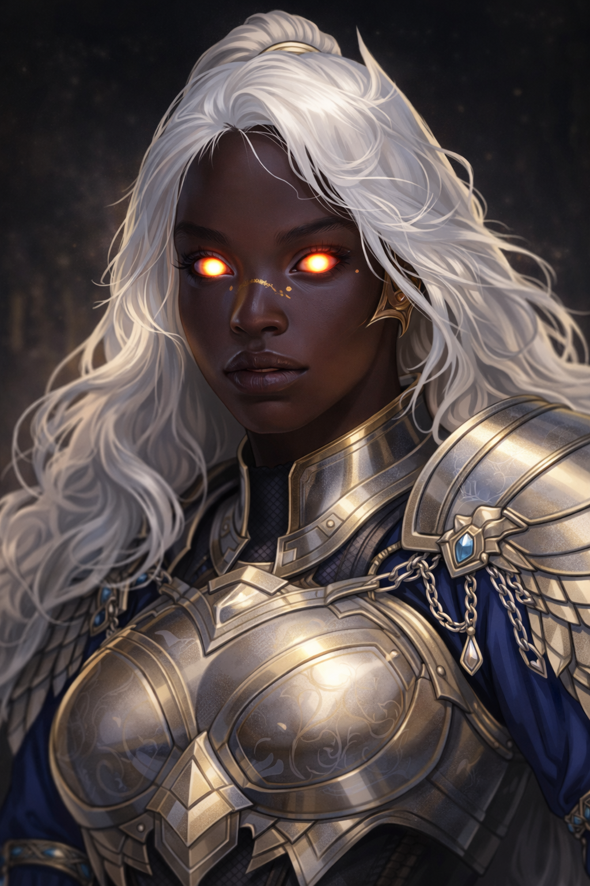

# Identity and spelling

**Irdra** is the general at Dochas Ùr’s gate in Maren’s dream. Her surname remains unknown.[^portrait-confirmation]

# Depicted encounter

In the prologue/dream set fourteen years before the narrated present, she commands the force outside Dochas Ùr's barrier. She is depicted in celestial-looking full plate, with dark skin, white hair, gold-freckled features, and a large unusual sword. She is described with a garbled ancestry term resembling Aasimar; ancestry remains unconfirmed.[^transcript]

She accuses the city's people of harming outsiders, invokes the [Court of Conscience](../factions/court-of-conscience.md), seeks disarmament and compliance with conditions, asks the child to cross the barrier, and later requests 200–300 people travel back aboard the fleet for discussions. These are attributed demands/assertions, not proof that her accusations or motives are true.[^transcript]

She claims the barrier could be destroyed, but her strike fails to break through. This encounter appears in Maren’s dream. Whether it depicts his past, another person’s experience, or events that truly happened remains unresolved.[^transcript][^dream-dictation]

# Related

[Session recap](../sessions/2026-09-28-drifters-s001.md), [city](../places/city-of-hope.md), name review.

# Voyage testimony

Nathaniel said the woman from Maren’s dream was well known. Her wider reputation remains uncertain.[^sea-dictation]

[^transcript]: Supplied transcript lines 37–155 (framing and appearance), 193–311 (assertions and demands), 387–455 (name, barrier claim, strike, requested passengers), 499–505 (spelling passage), 681–687 (dream uncertainty).

[^dream-dictation]: User dictation during the September 28 session walkthrough, supplied September 30; preserved verbatim supplementary note.

[^sea-dictation]: User retrospective note, heading “sea journey, Howl crossing and Eok testimony”: paragraphs 1–2 (captain, affliction and Titans), 3–4 (Howl crossing and perceptions), 5–8 (Nathaniel’s fragmentary Eok account and within-note victus correction).

[^portrait-confirmation]: User portrait-identity confirmation, line 1 (Irdra is the general at the gate) and line 3 (meow-shau depicts the White Fang’s captain; his name’s spelling remains unconfirmed).
