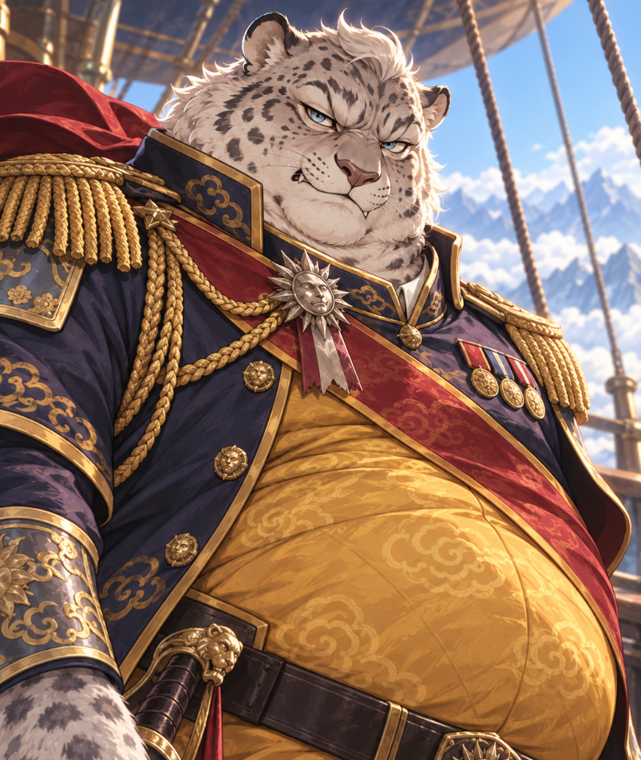

# Introduction

The party was introduced to **General Maochao**, a rakshasa who captained an airship. This introduction does not yet establish that his airship was offered, acquired or boarded.[^arrival-dictation]

**Maochao** is the White Fang’s captain. His name’s exact spelling remains unsettled; this is a provisional rendering.[^portrait-confirmation]

[City](../places/lastings.md), [mission](../quests/airship-investigation.md), [session](../sessions/2026-09-28-drifters-s001.md).

# Escort after the audience

Maochao escorted the party back to their ship after Therus rejected them, and conveyed severe restrictions on independent movement, conversation and exploration. Military accompaniment was required; precise scope and duration remain unclear.[^audience-dictation]

See [audience](../events/therus-audience.md).

# Session 3 development

Maochao arrives aboard the White Fang, resists Emeric’s Calm, and attacks Cole with a rapier. His attempt to disarm Cole fails. His final fate remains unknown.[^s003]

[Combined session](../sessions/session-003-combined.md).

[^arrival-dictation]: User retrospective note, heading “arrival, Court leadership and airship captain”: paragraphs 1–2 (Therus, Paedan and Morgaen), paragraph 3 (reported gods, city levels, Maochao and species observed).

[^audience-dictation]: User retrospective note, heading “Therus audience and restricted movement”: paragraph 1 (ship, cube and encounter space), 2 (child, family and leadership), 3 (guardian-beast claims), 4 (rejection), 5 (mental-link access), 6 (escort and restrictions).

[^s003]: Supplied Session 3 transcript, 1375–1545, 2425–2495, 3219–3555. No verified audio timestamps or independent speaker alignment.

[^portrait-confirmation]: User portrait-identity confirmation, line 1 (Irdra is the general at the gate) and line 3 (meow-shau depicts the White Fang’s captain; his name’s spelling remains unconfirmed).

# Session 5 — retirement celebration

[Smidgen](smidgen.md) identifies the general as the White Fang’s captain holding a retirement party in [Alora Valley](../places/alora-valley.md), while refusing to rest until the pursued people are caught. At session end a rakshasa in party clothes with a rapier is visible at that gathering. Bindings, recovered possessions and eight coffin-like containers stand near the stage. His canonical spelling remains unconfirmed; “Mao Shao / Meowsh / Miasha” are further transcription forms, not approved aliases.[^s005]

[Session 5](../sessions/session-005-combined.md).

[^s005]: Original recording, 03:45:00–03:49:00; 04:13:00–04:15:30. Local machine transcription; no independent audio listening or speaker diarization.

# Session 6 — preparations before dawn

The general remains a significant threat at the retirement stage. Later he studies a map while coordinates are read out and possessions are taken off a table; a concerned page supplies news. His attention shifts away from the coffins to a problem the party cannot identify. The Court’s spoken rank for him is rendered “preface,” with its spelling unresolved. The party has not fought him again or executed the diversion.[^s006]

[Session 6](../sessions/session-006-combined.md).

[^s006]: Original recording, 00:54:00–00:56:00; 01:51:00–01:54:00; 02:02:00–02:04:00. Local machine transcript compared with supplied transcript; no independent audio listening or speaker diarization.
