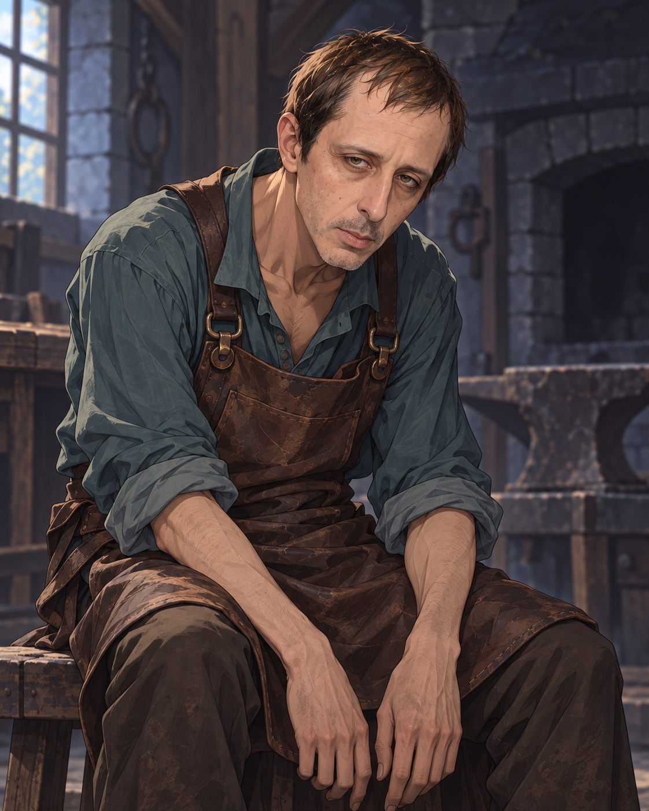

# Identity and forge

The exhausted human blacksmith calls himself a name rendered **Recknar / Reckonar**; its spelling remains provisional. His once-renowned forge stands beside an unfinished settlement and several mine entrances in the forest south of [Alora Valley](../places/alora-valley.md). Work has stopped for about two years. Display cases are broken, plaques empty, and stock metal used up. He is sleepless and malnourished, and a rope with a loop suggests he has been preparing to end his life.[^s005]

# Family and the Bloom

He says [the Bloom](../factions/the-bloom.md) came about ten years earlier seeking something below his mines. Its leader had a walking tree marked with flower symbols. About four years, thirteen days and five hours before this meeting, a wooden humanoid with the same markings returned with several companions. He emerged alone from the mines, killed the smith’s wife and two children, named himself **[Tallow](tallow.md)** and invited revenge. The smith requested Court protection, but help arrived only weeks later. The party’s checks suggest he is telling the truth as he understands it; the unknown object in the mines and the Court’s complete account remain unavailable.[^s005]

# Basement and revenge

Two dead Court messengers hang shackled in his bloodied basement. A jagged [cursed blade](../lore/blacksmiths-cursed-blade.md) lies nearby. He admits killing the same captives repeatedly for years to exhaust the local [resurrection plot](../lore/resurrection-plots-and-victus.md). He says its boundary has receded by miles and the Court barracks beyond Alora may now be outside its reach. The two captives have stopped returning. Their victus objects are absent; earlier killings involved sedation and direct heart wounds, while the latest show less care for their suffering.[^s005]

He wanted revenge against the Court for failing his family, rather than having reached Tallow himself. He says he intends to kill as many Court members as possible and then himself. The party leaves him alive; neither his later fate nor distant barracks casualties are established.[^s005]

# The party’s departure

He gives the party a cart and offers shelter and use of the forge. Cole lights the hearth and offers to avenge his family if Tallow is ever encountered, but fails to sustain the brief hope that offer raises. Cole also hears many angry voices that seem angry *with* the smith rather than at him. Koris removes the blade and entrusts it to Haskel. The party chooses to continue toward its missing bodies instead of exploring the mines.[^s005]

[Session 5](../sessions/session-005-combined.md).

[^s005]: Original recording, 01:31:00–01:59:30; 02:00:00–02:53:00. Local machine transcription; no independent audio listening or speaker diarization.
