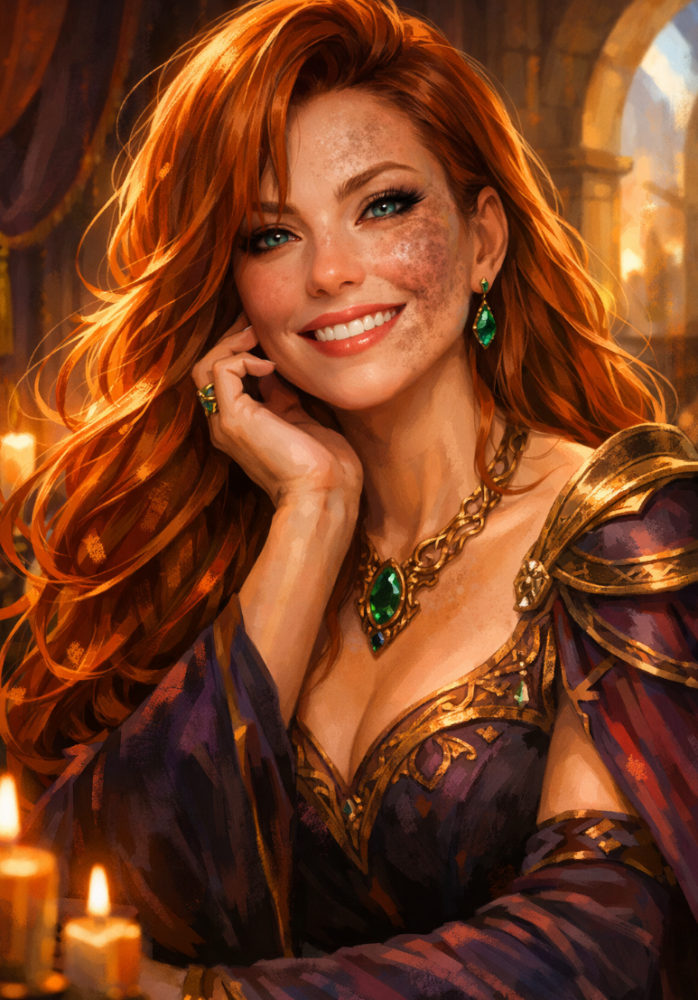

# Therica Ashtongue

Therica is the daughter of **Iolas Ashtongue IV**, Highhelm’s former king. She is an **NPC** who accompanies the adventurers, rather than a member of the player-character roster.[^therica-dictation][^primer][^therica-role]

## Cold-iron affliction

Therica suffers a curse resembling a severe allergy to **cold iron or wrought metal**, with portions of her face taking on a grayscale appearance. The affliction has been compared to Fae and to a similar condition in Campaign 1. Its cause, exact effects and relationship to those other conditions remain unknown.[^therica-dictation][^sea-dictation]

## The airship investigation

After the [sun shattered and reformed](../events/sun-shattering.md), Therica summoned the party and recounted Dochas Ùr’s relationship with the [Court of Conscience](../factions/court-of-conscience.md). She proposed traveling to Lastings in Eok to borrow, buy or otherwise obtain an airship. Rios lacks that technology; she believes an airship could help them investigate the falling object and any threat it poses to their homeland or the world.[^therica-dictation][^airship-dictation]

Accounts of the Pillars flying unusually high led Therica to suspect that the world’s sky or ceiling might be reachable by airship. No such boundary has yet been established.[^airship-dictation]

## Joining the voyage

The party accepted her mission, and Emeric persuaded her to join them. Therica feared that House Glaren would seek power in Dochas Ùr during their absence and might rule by the time they returned. That remains her prediction, rather than a confirmed takeover. Sygar, one of the original Pillars, was an ostracized son of the House who renounced his family.[^departure-dictation]

## The cosmic passage and return

Therica helped secure the chain to the steering mast while Cole boarded the astral whale. During the return, an articulated wooden woman appeared, likely Therica, though her identity and relationship to the earlier clay figure remain uncertain. Therica was later seen searching the wreck.[^s004]

[Session 1](../sessions/2026-09-28-drifters-s001.md) · [Session 4](../sessions/session-004-combined.md) · [Airship investigation](../quests/airship-investigation.md)

[^primer]: Preserved Drifters primer, PDF page 5, “The Forbidden Island,” names the slain then-king Iolas Ashtongue IV.

[^therica-dictation]: User retrospective dictation, heading “public fear and Therica summons”: paragraph 1 (fear and twenty-year context), paragraph 2 (Therica, parentage and condition), paragraph 3 (Court history and proposed journey).

[^airship-dictation]: User retrospective dictation, heading “Therica airship request”: paragraph 1 (Pillars and high-flight accounts), paragraph 2 (technology, destination and request), paragraph 3 (dictation workflow instruction), paragraph 4 (investigation goal).

[^departure-dictation]: User retrospective note, heading “acceptance, companions and departure briefing”: paragraphs 1–3 (acceptance, persuasion and political concern), paragraph 4 (research, captain and Saga), paragraph 5 (departure and incomplete precept briefing).

[^sea-dictation]: User retrospective note, heading “sea journey, Howl crossing and Eok testimony”: paragraphs 1–2 (captain, affliction and Titans), 3–4 (Howl crossing and perceptions), 5–8 (Nathaniel’s fragmentary Eok account and within-note victus correction).

[^s004]: Supplied transcript, original Unicode-delimited paragraphs 103–107, 383–386, 785–786, 906–908, 1010. No independently verified audio timestamp or speaker alignment.

[^therica-role]: User role correction note, line 1: Therica Ashtongue is an NPC, not a PC, and is commonly voiced by the GM.
